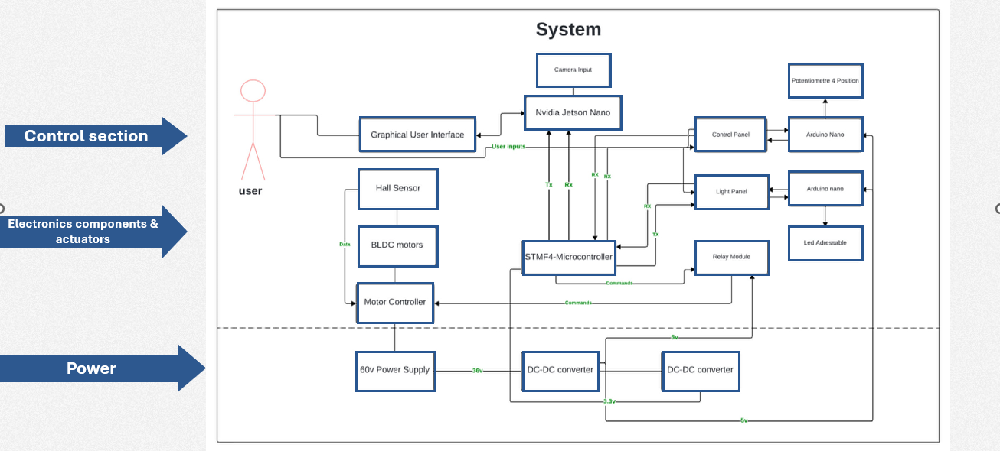
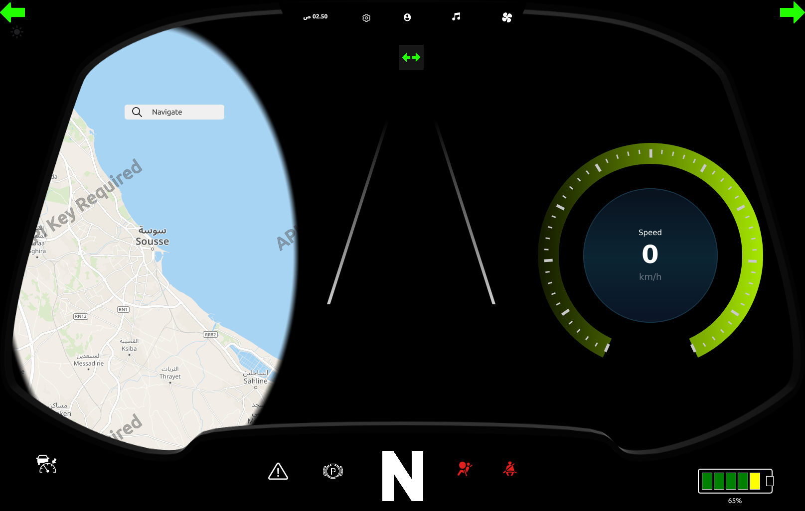
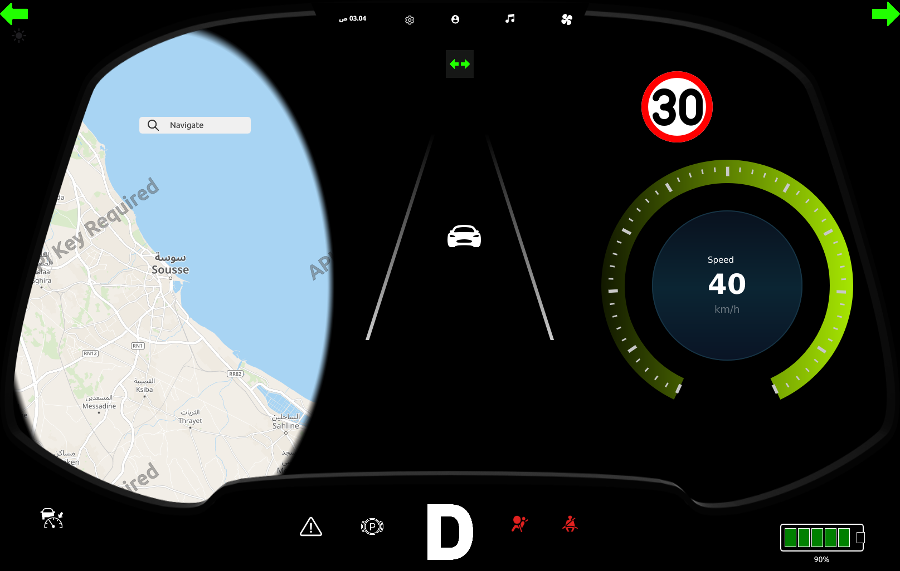
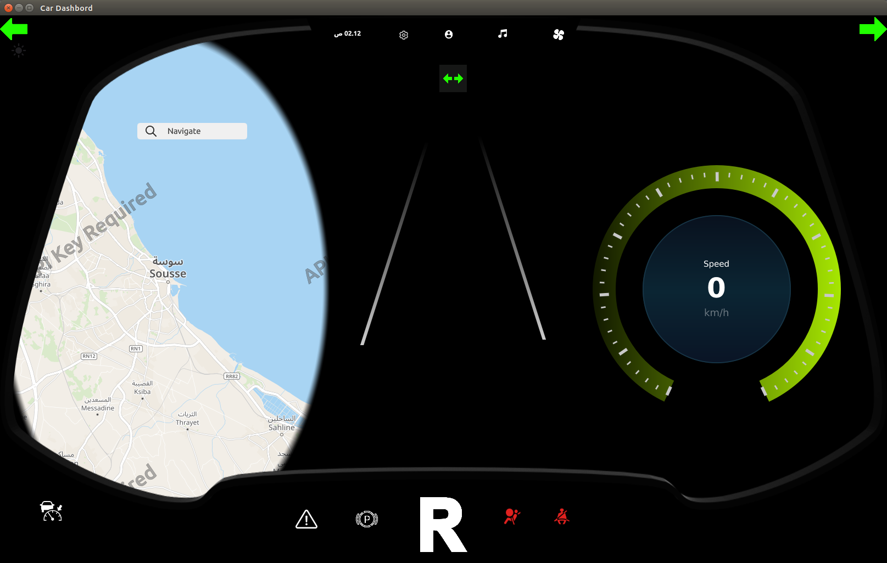
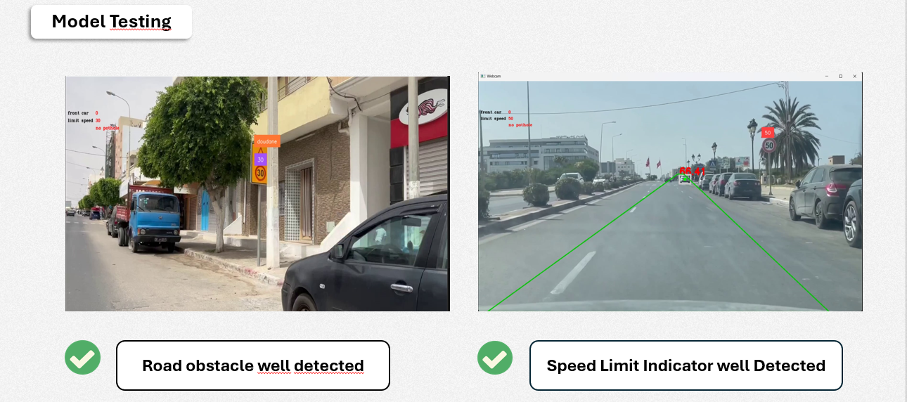

# EV-Dashboard-PFE
Digital dashboard for a 3-wheel electric vehicle. Real-time monitoring and control of vehicle data.

## Objectives
- Display speed, battery, and motor status.
- Monitor sensors and control actuators via STM32.
- Provide a user-friendly interface on a 7-inch touchscreen.

## Technologies
- Qt & QML (GUI)
- Python & OpenCV (camera & vision)
- STM32 (motor & sensor control)
- Jetson Nano (interface control)

## Architecture

## Screenshots

## opening camera while backward 

## Results
- Real-time vehicle monitoring and control.
- Successfully integrated STM32 and Jetson Nano systems.
- Fully functional GUI for user interaction.

## Demo

## ADAS Detection Capture
  
*Placeholder for AI model detection: speed limit and vehicle ahead.*
